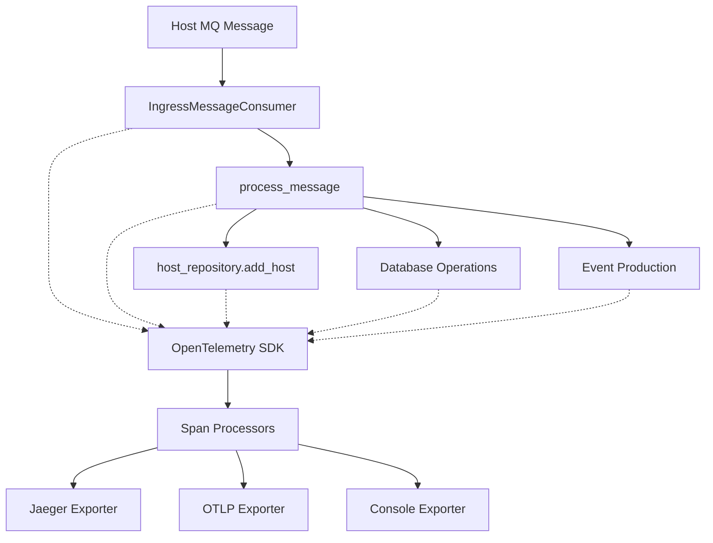

# OpenTelemetry Integration for Insights Host Inventory

This document describes the OpenTelemetry (OTel) integration for the Insights Host Inventory service, providing distributed tracing capabilities to monitor and debug host update operations.

## Overview

OpenTelemetry is an observability framework that provides APIs, libraries, agents, and instrumentation to generate, collect, and export telemetry data (metrics, logs, and traces). Our implementation focuses on **distributed tracing** to track host operations across the service.

## Features

- **Automatic instrumentation** for Flask, SQLAlchemy, Kafka, and PostgreSQL
- **Custom tracing decorators** for host operations
- **Message queue processing tracing** with Kafka
- **Error tracking** and exception recording
- **Configurable sampling** to control trace volume
- **Multiple exporters** (Jaeger, OTLP, Console)
- **Batch processing tracing** for performance optimization

## Architecture



## Configuration

### Environment Variables

| Variable | Description | Default | Example |
|----------|-------------|---------|---------|
| `OTEL_ENABLED` | Enable/disable OpenTelemetry | `false` | `true` |
| `OTEL_SERVICE_NAME` | Service name for traces | `insights-host-inventory` | `inventory-prod` |
| `OTEL_SERVICE_VERSION` | Service version sha | `` | `abcdfe12` |
| `OTEL_JAEGER_ENDPOINT` | Jaeger collector endpoint | - | `jaeger-collector:14268` |
| `OTEL_OTLP_ENDPOINT` | OTLP endpoint | - | `http://otel-collector:4317` |
| `OTEL_CONSOLE_EXPORTER` | Enable console output | `false` | `true` |
| `OTEL_TRACE_SAMPLE_RATE` | Sampling rate (0.0-1.0) | `0.1` | `0.05` |
| `OTEL_CUSTOM_ATTRIBUTES` | Custom resource attributes | - | `region=us-east,cluster=prod` |

### Instrumentation Control

| Variable | Description | Default |
|----------|-------------|---------|
| `OTEL_INSTRUMENT_FLASK` | Auto-instrument Flask | `true` |
| `OTEL_INSTRUMENT_SQLALCHEMY` | Auto-instrument SQLAlchemy | `true` |
| `OTEL_INSTRUMENT_KAFKA` | Auto-instrument Kafka | `true` |
| `OTEL_INSTRUMENT_PSYCOPG2` | Auto-instrument PostgreSQL | `true` |

## Quick Start

### 1. Enable OpenTelemetry

```bash
export OTEL_ENABLED=true
export OTEL_SERVICE_NAME=insights-host-inventory
export OTEL_CONSOLE_EXPORTER=true
```

## Production Setup

### With Jaeger

```bash
export OTEL_ENABLED=true
export OTEL_SERVICE_NAME=insights-host-inventory
export OTEL_JAEGER_ENDPOINT=jaeger-collector.monitoring:14268
export OTEL_TRACE_SAMPLE_RATE=0.1
export OTEL_ENVIRONMENT=production
```

### With OTLP (OpenTelemetry Collector)

```bash
export OTEL_ENABLED=true
export OTEL_SERVICE_NAME=insights-host-inventory
export OTEL_OTLP_ENDPOINT=http://otel-collector.monitoring:4317
export OTEL_TRACE_SAMPLE_RATE=0.1
export OTEL_ENVIRONMENT=production
```

## Instrumented Operations

### Host Message Processing

The following operations are automatically traced:

1. **Message Parsing** (`parse_operation_message`)
   - Validates incoming JSON messages
   - Records parsing failures and validation errors

2. **Host Message Handling** (`handle_message`)
   - Processes incoming host messages from Kafka
   - Tracks request IDs and platform metadata

3. **Host Processing** (`process_message`)
   - **Ingress Processing**: New host creation/updates
   - **System Profile Updates**: Host system profile modifications
   - Records host ID, org ID, reporter, and operation results

4. **Database Operations**
   - Automatic SQLAlchemy instrumentation
   - Tracks database queries and transactions

5. **Event Production** (`write_event_message`)
   - Traces event message creation and publishing
   - Records event types and message attributes

6. **Batch Processing** (`post_process_rows`)
   - Tracks batch sizes and processing times
   - Monitors database commits and message batch writes

### Trace Attributes

#### Host-specific Attributes
- `host.id` - Host identifier
- `host.org_id` - Organization ID
- `host.reporter` - Reporter system
- `host.account` - Account identifier
- `host.display_name` - Host display name
- `host.canonical_facts` - Host canonical facts

#### Operation Attributes
- `operation.name` - Operation type
- `operation.result` - Result (created/updated/failed)
- `operation.type` - Processing type (batch/single)

#### Message Queue Attributes
- `messaging.system` - Always "kafka"
- `messaging.operation` - Operation type
- `messaging.topic` - Kafka topic name
- `batch.size` - Number of messages in batch

#### Identity Attributes
- `identity.auth_type` - Authentication type
- `identity.type` - Identity type (User/System)

## Custom Instrumentation

### Using Decorators

```python
from app.otel_instrumentation import (
    trace_host_operation,
    trace_mq_message_processing
)

@trace_host_operation(
    "custom_host_operation",
    extract_host_id=lambda _, host_data, *args, **kwargs: host_data.get("id"),
    extract_org_id=lambda _, host_data, *args, **kwargs: host_data.get("org_id"),
)
def my_host_function(host_data):
    # Your code here
    return result
```

### Manual Span Creation

```python
from app.otel_instrumentation import create_child_span, add_span_attributes

with create_child_span("custom_operation") as span:
    add_span_attributes({
        "custom.attribute": "value",
        "host.count": len(hosts),
    })
    # Your code here
```

### Recording Results

```python
from app.otel_instrumentation import record_host_operation_result

# After a host operation
record_host_operation_result(operation_result, {
    "id": host.id,
    "org_id": host.org_id,
    "reporter": host.reporter,
})
```

## Monitoring and Observability

### Key Metrics to Monitor

1. **Trace Volume**: Number of traces per minute
2. **Error Rate**: Percentage of traces with errors
3. **Latency**: P95/P99 latencies for host operations
4. **Batch Processing**: Batch sizes and processing times

### Important Spans to Monitor

- `inventory.mq.host_message_handling` - Overall message processing
- `inventory.ingress_host_processing` - Host creation/updates
- `inventory.system_profile_update` - System profile updates
- `inventory.write_event_message` - Event production
- `db_commit` - Database transaction commits

### Troubleshooting Common Issues

#### High Trace Volume
- Reduce `OTEL_TRACE_SAMPLE_RATE` (e.g., from 0.1 to 0.01)
- Check for trace loops or excessive child spans

#### Missing Traces
- Verify `OTEL_ENABLED=true`
- Check exporter configuration
- Ensure sampling rate > 0

#### Performance Impact
- Monitor CPU and memory usage
- Adjust batch processing parameters
- Consider async span processing

## Performance Considerations

### Sampling Strategy

- **Development**: 100% sampling (`OTEL_TRACE_SAMPLE_RATE=1.0`)
- **Testing**: 50% sampling (`OTEL_TRACE_SAMPLE_RATE=0.5`)
- **Production**: 1-10% sampling (`OTEL_TRACE_SAMPLE_RATE=0.01-0.1`)

### Resource Usage

OpenTelemetry adds minimal overhead:
- **CPU**: < 1% additional overhead
- **Memory**: ~50MB additional memory for span buffers
- **Network**: Depends on sampling rate and trace complexity

### Optimization Tips

1. **Use appropriate sampling rates** for your traffic volume
2. **Limit span attributes** to essential data only
3. **Batch span exports** for better performance
4. **Monitor exporter health** to prevent backpressure

## Troubleshooting

### Common Issues

1. **No traces appearing**
   - Check `OTEL_ENABLED=true`
   - Verify exporter endpoints are reachable
   - Ensure sampling rate > 0

2. **High memory usage**
   - Reduce sampling rate
   - Check for span leaks (unclosed spans)
   - Monitor batch processor settings

3. **Missing span data**
   - Verify decorator usage
   - Check span attribute limits
   - Ensure proper error handling

### Debug Mode

Enable debug logging:

```bash
export OTEL_CONSOLE_EXPORTER=true
export OTEL_TRACE_SAMPLE_RATE=1.0
```

### Health Checks

Monitor the following for healthy operation:
- Exporter connectivity
- Span queue sizes
- Error rates in spans
- Performance metrics

## Future Enhancements

1. **Metrics Integration**: Add OpenTelemetry metrics alongside Prometheus
2. **Correlation IDs**: Enhanced request correlation across services
3. **Custom Samplers**: Business logic-based sampling decisions
4. **Span Links**: Connect related operations across different traces
5. **Resource Detection**: Automatic cloud resource detection

## Support

For issues or questions:
1. Check the test script: `python test_otel_integration.py`
2. Review logs for OpenTelemetry initialization messages
3. Verify configuration with the console exporter
4. Monitor span attributes and timing in your tracing backend

## References

- [OpenTelemetry Python Documentation](https://opentelemetry-python.readthedocs.io/)
- [OpenTelemetry Specification](https://opentelemetry.io/docs/specs/otel/)
- [Jaeger Documentation](https://www.jaegertracing.io/docs/)
- [OTLP Specification](https://opentelemetry.io/docs/specs/otlp/)
